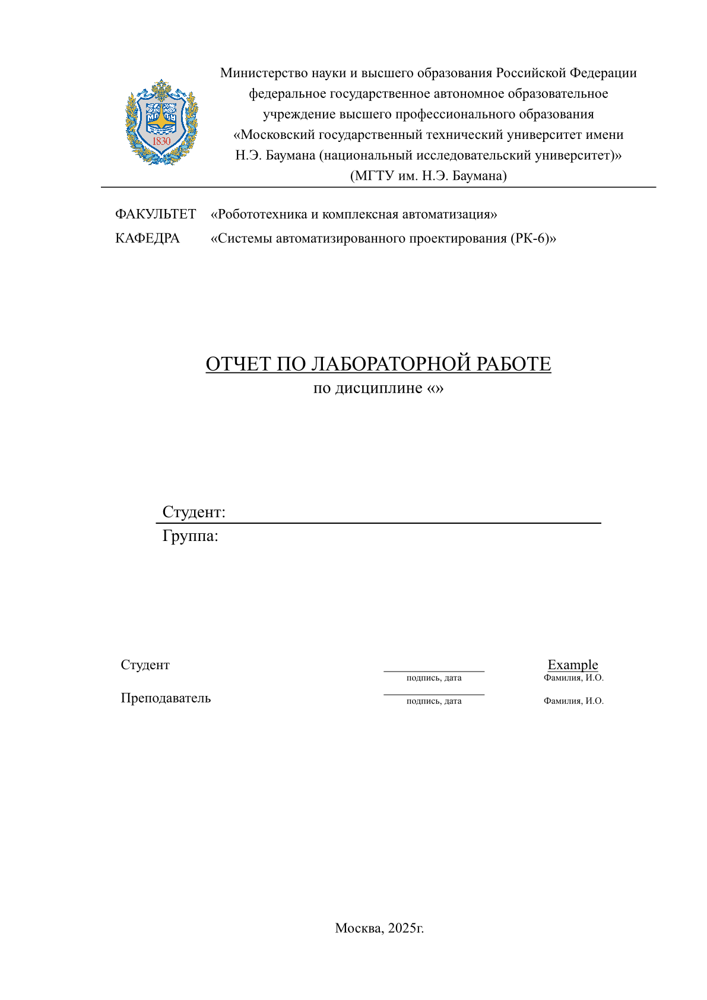

# Typst package for BMSTU reports

This repository provides a [Typst](https://typst.app/home/) package for creating reports or other paperwork utilizing BMSTU style.

> BMSTU stands for [Bauman Moscow State Technical University](https://bmstu.ru/).

## Installation

Since this package is not yet included in the official [Typst package list](https://github.com/typst/packages), using it requires some manual setup.

One way to do this is by placing the package in your local Typst package directory:
```sh
git clone https://github.com/ITesserakt/typst-bmstu-report
mkdir -p $HOME/.local/share/typst/packages/bmstu-report/0.1.1
cp -rv typst-bmstu-report/* $HOME/.local/share/typst/packages/bmstu-report/0.1.1/
```

> These commands are intended for Linux and copy the package contents to your local Typst package path.

## Usage

A simple usage example is available in the `example.typ` file.
In general, using the package involves importing it and overlaying a document with the provided template function:

```typst
#import "@local/bmstu-report@0.1.1": template
#show: template.with(
    author: "Some author",
    // ...
)

= Your text goes here
```

Title page of an `example.typ` looks like this:



### Fonts

To use the only true fonts™, you need to provide the path to the `fonts` folder for typst compiler.
This can be done either via `TYPST_FONT_PATHS` environment variable or the `--font-paths` command line option.

**The first option:**
```sh
export TYPST_FONT_PATHS "${TYPST_FONT_PATHS}:$HOME/.local/share/typst/packages/bmstu-report/0.1.1/fonts"
```

**The second option:**
```sh
typst compile --font-paths $HOME/.local/share/typst/packages/bmstu-report/0.1.1/fonts <file.typ>
```
